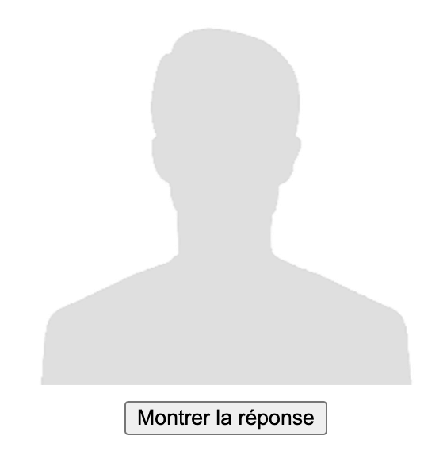
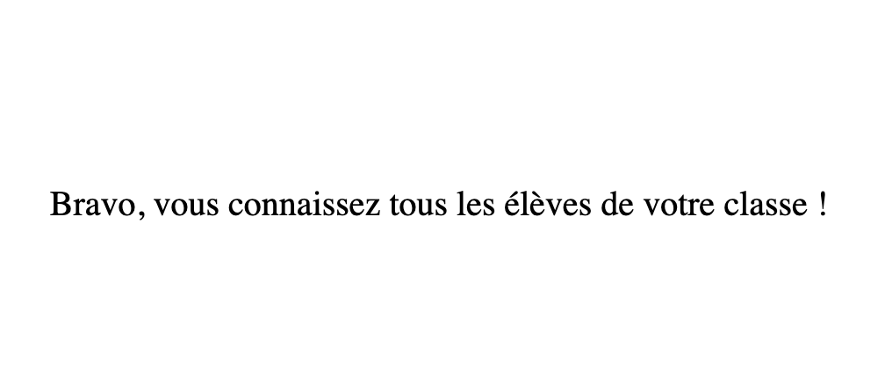

# Trombiquiz

##  Un outil pour apprendre les prénoms de ses élèves

Il est essentiel de connaître très rapidement les prénoms de ses élèves.
- Les élèves sentent qu'ils sont respectés en tant que personne et cela crée tout de suite un climat de confiance.
- La gestion de classe en cas de problème est beaucoup plus facile.

Je propose ici un outil, Trombiquiz, qui permet à partir d'un trombinoscope en ligne de mémoriser plus facilement les prénoms de ses élèves.

Si on dispose des photos avant même le premier cours, on peut ainsi arriver en classe en connaissant déjà au moins une bonne partie des élèves, ce qui les surprend souvent de manière très positive !

## Comment ça marche ?

Trombiquiz est un "bookmarklet" qui ne fonctionne que si vous le mettez dans un favori afin de pouvoir cliquer dessus quand vous serez sur un trombinoscope de vos élèves.

Trombiquiz fonctionne directement avec les applications suivantes : 
- Pronote
- Ecole Directe

Il fonctionne aussi pour les photos des participants à une formation sur Moodle ou Magistère.

Si vous utilisez un autre logiciel : vous pouvez me demander de l'intégrer à ce script

Si vous disposez des fichiers des photos des élèves, vous pouvez aussi [créer une page HTML qui fonctionnera avec Trombiquiz](trombiquiz-creer-fichier.html).

> Attention, les logiciels ci-dessus peuvent évoluer. Si Trombiquiz ne fonctionne plus, il faudra soit simplement télécharger la nouvelle version, soit me l'indiquer pour que je fasse les changements nécessaires.

## 1/ Créer un nouveau favori

Affichez la barre de vos favoris et glisser-déposer le lien ci-dessous dans vos favoris :

<a href="javascript:!function(){let e,n,t,o,i,s,l;const r=function(){const n=window.location.href;return n.indexOf(&quot;pronote&quot;)&gt;-1?(e=document.body.querySelectorAll(&apos;div[role=&quot;main&quot;] img&apos;),t=e=&gt;e.alt.includes(&quot;Photo de&quot;),o=e=&gt;Array.from(e.classList).includes(&quot;ie-imgviewer&quot;),i=e=&gt;!(e.length&lt;3),s=e=&gt;e.dataset.src,l=e=&gt;{const n=s(e).split(&quot;?&quot;)[0],t=n.lastIndexOf(&quot;/&quot;),o=decodeURIComponent(n.substring(t+1).replace(&quot;.jpg&quot;,&quot;&quot;)),i=o.search(/[a-z&agrave;-&yuml;]/),l=o.substring(i-1),r=o.substring(0,i-1).replaceAll(&quot;_&quot;,&quot; &quot;);return l.replaceAll(&quot;_&quot;,&quot; &quot;)+&quot; &quot;+r},!0):n.indexOf(&quot;moodle&quot;)&gt;-1||n.indexOf(&quot;magistere&quot;)&gt;-1?(e=document.body.querySelectorAll(&quot;th img&quot;),t=e=&gt;e.classList.contains(&quot;userpicture&quot;),o=e=&gt;!0,i=e=&gt;!0,s=e=&gt;e.src,l=e=&gt;e.parentNode.textContent,!0):n.indexOf(&quot;ecoledirecte&quot;)&gt;-1?(e=document.body.querySelectorAll(&quot;.panel-eleve img&quot;),t=e=&gt;e.alt.includes(&quot;&eacute;l&egrave;ve&quot;),o=e=&gt;!e.src.includes(&quot;eleve&quot;),i=e=&gt;!0,s=e=&gt;e.src,l=e=&gt;e.parentNode.querySelector(&quot;p&quot;).textContent,!0):!!document.body.classList.contains(&quot;apprendre-prenoms&quot;)&amp;&amp;(e=document.body.querySelectorAll(&quot;#image-list img&quot;),t=e=&gt;!0,o=e=&gt;!0,i=e=&gt;!0,s=e=&gt;e.src,l=e=&gt;e.parentNode.querySelector(&quot;span[contenteditable]&quot;).textContent,!0)}();if(0==r)return void alert(&quot;Attention, cet outil ne fonctionne que sur certains sites : \nsur Pronote, Ouvrez Pronote en ligne, puis allez dans Mes donn&eacute;es / Classes/&eacute;l&egrave;ves / Trombinoscope&quot;);if(n=Array.from(e),!i(n))return void alert(&quot;Pour que l&apos;outil fonctionne, il faut aller dans Mes donn&eacute;es / Classes/&eacute;l&egrave;ves / Trombinoscope, puis s&eacute;lectionner une classe&quot;);window.confirm(&apos;Apprendre les pr&eacute;noms :\n- Par ordre al&eacute;atoire &rarr; clic sur OK (ou touche &quot;Enter&quot;).\n- Par ordre alphab&eacute;tique &rarr; clic sur Annuler (ou touche &quot;Esc&quot;)\n\nAttention, pour que l\&apos;outil fonctionne, il faut que toutes les photos des &eacute;l&egrave;ves soient visibles sur la page. \n\nVotre navigateur bloquera l\&apos;outil si vous mettez trop de temps &agrave; cliquer : relancez-le ou autorisez les pop-up&apos;)&amp;&amp;function(e){for(let n=e.length-1;n&gt;0;n--){const t=Math.floor(Math.random()*(n+1));[e[n],e[t]]=[e[t],e[n]]}}(n);!function(e){var n=window.open();n&amp;&amp;!n.closed&amp;&amp;function(e,n){e.document.open(),e.document.write(n),e.document.close()}(n,e)}(function(e){for(var n=&apos;&lt;!DOCTYPE html&gt;&lt;html lang=&quot;fr&quot;&gt;&lt;head&gt;&lt;meta charset=&quot;UTF-8&quot;&gt;&lt;meta name=&quot;viewport&quot; content=&quot;width=device-width, height=device-height, initial-scale=1.0&quot;&gt;&lt;/meta&gt;&lt;title&gt;Trombiquiz&lt;/title&gt;&lt;/head&gt;&lt;style&gt;div{margin-top:10px; text-align:center;} section, footer, div {display:none;} button {margin:10px;} footer {display: none; justify-content: center; align-items: center; height: 50%; font-size: 20px;} .noPhotos{display:block!important;} b{display:block;margin-top:2em;}img{height:350px;}&lt;/style&gt;&lt;body&gt;&apos;,i=0;i&lt;e.length;i++){const r=e[i];if(t(r)){const e=s(r),t=l(r);n+=&apos;&lt;div class=&quot;eleve&quot;&gt;&apos;,n+=&apos;&lt;img src=&quot;&apos;+e+&apos;&quot; /&gt;&lt;br&gt;&apos;,o(r)?(n+=&apos;&lt;button onclick=&quot;montrerNomPrenom()&quot;&gt;Montrer la r&eacute;ponse&lt;/button&gt;&apos;,n+=&apos;&lt;section class=&quot;sectionReponse&quot;&gt;&apos;+t+&quot;&lt;br&gt;&quot;):n+=&apos;&lt;section class=&quot;sectionReponse noPhotos&quot;&gt;&lt;b&gt;Pas de photo disponible !&lt;/b&gt;&lt;br&gt;&apos;+t+&quot;&lt;br&gt;&quot;,n+=&apos;&lt;button onclick=&quot;difficile()&quot;&gt;Difficile&lt;/button&gt;&apos;,n+=&apos;&lt;button onclick=&quot;facile()&quot;&gt;Facile&lt;/button&gt;&lt;/section&gt;&lt;/div&gt;&apos;}}return n+=&quot;&lt;footer&gt;Bravo, vous connaissez tous les &eacute;l&egrave;ves de votre classe !&lt;/footer&gt;&quot;,n+=&apos;&lt;script&gt;\n      let end = false;\n      let index = 0;\n      let show = false;\n      let indexElevesFaciles = [];\n\n      const eleves = document.querySelectorAll(&quot;.eleve&quot;);\n      eleves[index].style.display = &quot;block&quot;;\n\n      const sectionsReponse = document.querySelectorAll(&quot;.sectionReponse&quot;);\n\n      function montrerNomPrenom() {\n        sectionsReponse[index].style.display = &quot;block&quot;;\n        show = true;\n      }\n\n      function eleveSuivant() {\n\t\tdo {\n          sectionsReponse[index].style.display = &quot;none&quot;;\n          eleves[index].style.display = &quot;none&quot;;\n          index = (index + 1) % eleves.length;\n        } while (indexElevesFaciles.includes(index) &amp;&amp; index &lt; eleves.length);\n        eleves[index].style.display = &quot;block&quot;;\n      }\n      function difficile() {\n        show = false;\n        eleveSuivant();\n      }\n      function facile() {\n        show = false;\n        indexElevesFaciles.push(index);\n        if (indexElevesFaciles.length == eleves.length) {\n          end = true;\n          const footer = document.querySelector(&quot;footer&quot;);\n          eleves[index].style.display = &quot;none&quot;;\n          footer.style.display = &quot;flex&quot;;\n        } else {\n          eleveSuivant();\n        }\n      }\n      window.addEventListener(&quot;keydown&quot;, function (event) {\n        if (event.key === &quot;Enter&quot; &amp;&amp; !end) {\n          montrerNomPrenom();\n        }\n        const isNoPhoto = eleves[index].querySelector(&quot;.noPhotos&quot;) !== null;\n\n        if (event.key === &quot;ArrowLeft&quot; &amp;&amp; (show || isNoPhoto)) {\n          difficile();\n        }\n        if (event.key === &quot;ArrowRight&quot; &amp;&amp; (show || isNoPhoto)) {\n          facile();\n        }\n      });\n    &lt;\/script&gt;&apos;,n+=&quot;&lt;/body&gt;&lt;/html&gt;&quot;}(n))}();">Trombiquiz</a>

## 2/ Afficher le trombinoscope de ses élèves

Par exemple sur Pronote (version en ligne) :

Cliquez sur “Mes données” / “Classes/élèves” / “Trombinoscope”


Choisissez la classe et cliquez sur votre nouveau favori “Trombiquiz”

## 3/ Apprendre les prénoms

### Choisir l'ordre de présentation

Trombiquiz ouvre un popup et vous propose d'apprendre soit les prénoms dans l'ordre aléatoire (ordre par défaut : cliquez sur OK ou appuyez sur Entrée), soit dans l'ordre alphabétique (cliquez sur Annuler ou appuyez sur Esc).

```warning
Attention : pour que Trombiquiz fonctionne, il faut qu'on puisse voir toutes les photos des élèves sur l'écran, et si vous mettez du temps à faire votre choix de l'ordre de présentation, votre navigateur va probablement bloquer l'ouverture de la page des photos (il faudra alors soit relancer Trombiquiz et répondre plus vite, soit accepter les popups).
``````


### S'entraîner à mémoriser les prénoms

Une page s'ouvre et Trombiquiz affiche une photo à la fois.



Quand vous pensez avoir retrouvé le prénom et le nom de l'élève, cliquez sur “Montrer la réponse”.
- Raccourci clavier : ⏎ (touche “Entrée”).


Si c'était facile, cliquez sur “Facile”. La photo de l'élève sera alors sortie de la liste.
- Raccourci clavier : &rarr; (flèche droite)

Si c'était difficile, cliquez sur “Difficile”. La photo reste dans la liste.
- Raccourci clavier : &larr; (flèche gauche)

Tant qu'il reste des photos dans la liste, l'outil parcourt la liste jusqu'à ce que vous ayez retrouvé tous les prénoms des élèves.



## Un outil libre et gratuit

Trombiquiz est diffusé sous licence libre. N'hésitez pas à modifier le script pour qu'il fonctionne avec une autre application. Les [sources](https://forge.apps.education.fr/eyssette/apprendre/-/blob/main/prenoms.js?ref_type=heads) sont sur la Forge des Communs Numériques Éducatifs.

Si vous avez un problème ou une demande d'évolution de l'outil, n'hésitez pas à me contacter, en utilisant de préférence les “[tickets](https://forge.apps.education.fr/eyssette/apprendre/-/issues)”. Vous pouvez sinon me contacter via les [réseaux sociaux](https://eyssette.forge.apps.education.fr).